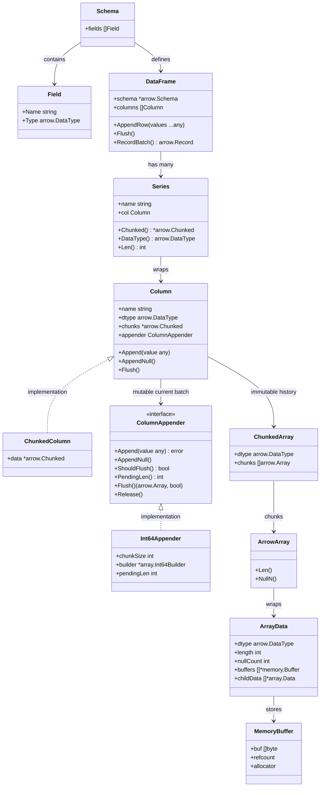
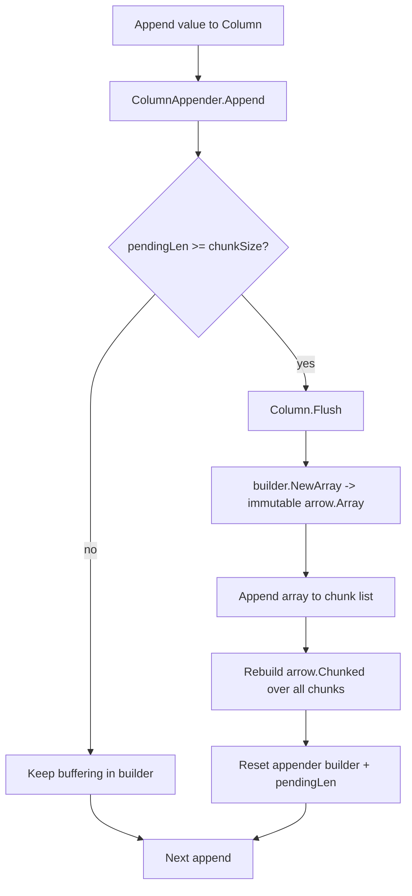
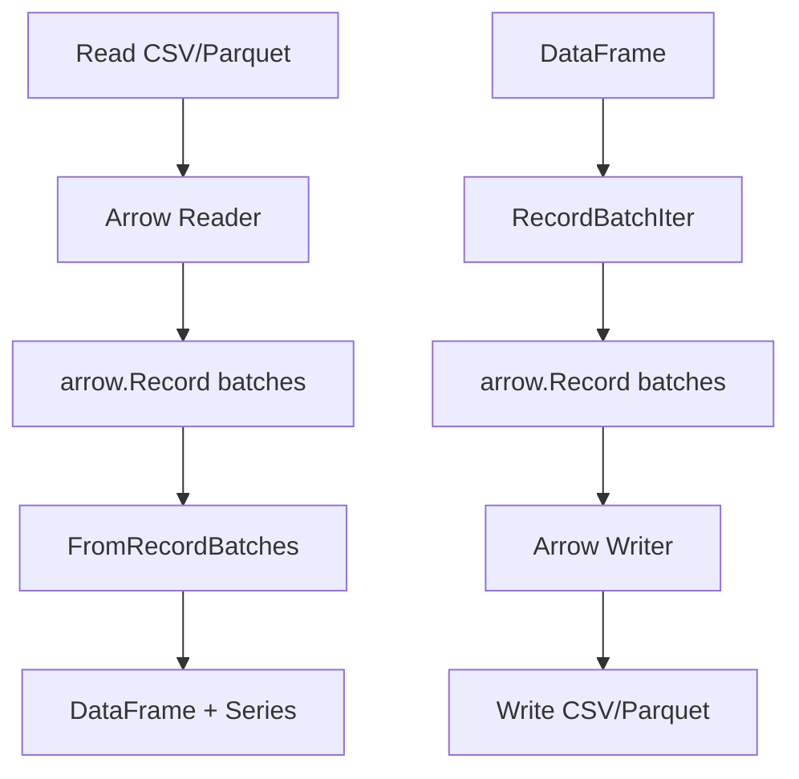

# Cosma DataFrame Architecture

This project follows an Arrow-native, append-first column model.

Architecture decisions are tracked in ADRs. See `docs/adr/README.md`.

## Class / Ownership Diagram

Related code:

- `schema.Schema` + `schema.Field`: [`schema/schema.go`](https://github.com/karthedew/cosma/blob/main/schema/schema.go), [`schema/field.go`](https://github.com/karthedew/cosma/blob/main/schema/field.go)
- `DataFrame` + `Series`: [`dataframe/dataframe.go`](https://github.com/karthedew/cosma/blob/main/dataframe/dataframe.go), [`dataframe/series.go`](https://github.com/karthedew/cosma/blob/main/dataframe/series.go)
- `Column` + `ChunkedColumn`: [`dataframe/column.go`](https://github.com/karthedew/cosma/blob/main/dataframe/column.go)

## DataFrame Structure

Cosma's DataFrame is a thin wrapper around Arrow chunked arrays, with a minimal
schema layer on top. Each `Series` is a named column backed by a `Column`
implementation, which in turn owns an `*arrow.Chunked` representing the physical
buffers. The `schema.Schema` type stores field metadata (`Name`, `Type`,
`Nullable`, and `ArrowType`) and is shared by the DataFrame and IO paths.

Key types in the codebase:

- `DataFrame` (`dataframe/dataframe.go`) holds a `*schema.Schema`, a slice of
  `Series`, and the logical height. See
  [`dataframe/dataframe.go`](https://github.com/karthedew/cosma/blob/main/dataframe/dataframe.go).
- `Series` (`dataframe/series.go`) pairs a name with a `Column` interface and
  exposes chunked access and dtype. See
  [`dataframe/series.go`](https://github.com/karthedew/cosma/blob/main/dataframe/series.go).
- `Column` (`dataframe/column.go`) is an interface implemented by
  `ChunkedColumn`, which wraps `*arrow.Chunked`. See
  [`dataframe/column.go`](https://github.com/karthedew/cosma/blob/main/dataframe/column.go).
- `schema.Schema` (`schema/schema.go`) is Cosma's lightweight schema with field
  lookup and copy-on-read semantics. See
  [`schema/schema.go`](https://github.com/karthedew/cosma/blob/main/schema/schema.go).

## IO Implementation

CSV and Parquet IO are built on Arrow readers/writers and a record batch
conversion layer that maps Arrow records into Cosma Series.

Read flow:

- `ReadCSV` (`dataframe/io.go`) uses Arrow's CSV reader with header and null
  handling enabled. It collects `arrow.Record` batches and converts them via
  `FromRecordBatchesWithOptions` (`dataframe/arrow_schema.go`). See
  [`dataframe/io.go`](https://github.com/karthedew/cosma/blob/main/dataframe/io.go)
  and [`dataframe/arrow_schema.go`](https://github.com/karthedew/cosma/blob/main/dataframe/arrow_schema.go).
- `ReadParquet` (`dataframe/io.go`) uses `pqarrow.FileReader` to read an Arrow
  table, then maps table columns to Series in `dataFrameFromTable`
  (`dataframe/io.go`). See
  [`dataframe/io.go`](https://github.com/karthedew/cosma/blob/main/dataframe/io.go).

Write flow:

- `WriteCSV` and `WriteParquet` build an Arrow schema from the DataFrame schema
  (optionally nullable), then stream `arrow.Record` batches produced by
  `RecordBatchIterWithSchema` (`dataframe/iter.go`) into Arrow writers. See
  [`dataframe/io.go`](https://github.com/karthedew/cosma/blob/main/dataframe/io.go)
  and [`dataframe/iter.go`](https://github.com/karthedew/cosma/blob/main/dataframe/iter.go).

Options:

- `CSVOptions` and `ParquetOptions` in `dataframe/io_options.go` provide
  defaults for nullable behavior, chunk sizing, and Arrow/Parquet properties.
  See [`dataframe/io_options.go`](https://github.com/karthedew/cosma/blob/main/dataframe/io_options.go).

## Append / Flush Lifecycle

Related code:

- `Series` builders and chunked helpers: [`dataframe/series_builder.go`](https://github.com/karthedew/cosma/blob/main/dataframe/series_builder.go)
- Record batch assembly: [`dataframe/iter.go`](https://github.com/karthedew/cosma/blob/main/dataframe/iter.go)

## IO Flow (CSV/Parquet)

Related code:

- CSV/Parquet entry points: [`dataframe/io.go`](https://github.com/karthedew/cosma/blob/main/dataframe/io.go)
- IO options: [`dataframe/io_options.go`](https://github.com/karthedew/cosma/blob/main/dataframe/io_options.go)
- Record batch conversion: [`dataframe/arrow_schema.go`](https://github.com/karthedew/cosma/blob/main/dataframe/arrow_schema.go)
- Example CLI usage: [`cmd/cosma-csv/main.go`](https://github.com/karthedew/cosma/blob/main/cmd/cosma-csv/main.go)

### Notes

- CSV reads default to header-based column names; missing values become nulls.
- Parquet reads preserve Arrow chunking and nulls, then map into Series.
- Writes emit Arrow records from `RecordBatchIter` and allow nullable schemas.

## Design Notes

- `ColumnAppender` owns temporary mutable Arrow builders.
- `Column` owns immutable arrays and exposes logical `*arrow.Chunked`.
- Flushes are safe to call repeatedly; when empty they are no-ops.
- Builders and arrays are reference-counted and must be released.
