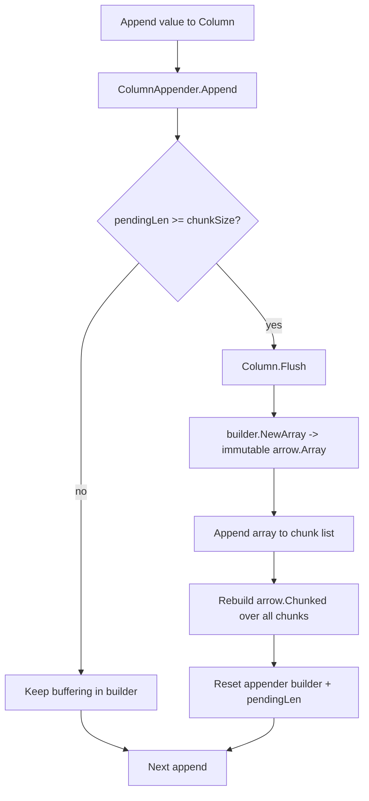
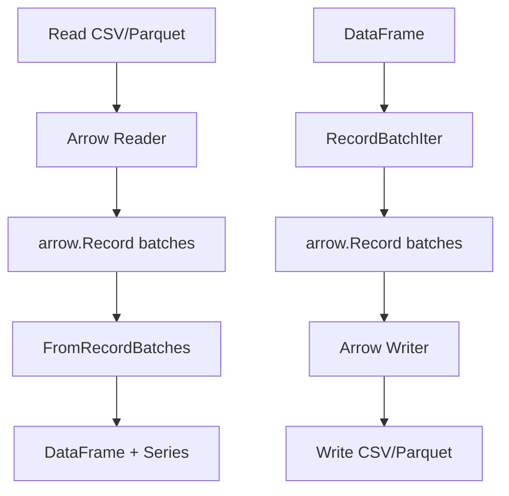

# Cosma DataFrame Architecture

This project follows an Arrow-native, append-first column model.

## Class / Ownership Diagram

```mermaid
classDiagram
    class Schema {
      +[]Field{Name, DataType}
    }

    class DataFrame {
      +schema *arrow.Schema
      +columns []Column
      +AppendRow(values ...any)
      +Flush()
      +RecordBatch() arrow.Record
    }

    class Column {
      +name string
      +dtype arrow.DataType
      +chunks *arrow.Chunked
      +appender ColumnAppender
      +Append(value any)
      +AppendNull()
      +Flush()
    }

    class ChunkedArray {
      +dtype arrow.DataType
      +chunks []arrow.Array
    }

    class ColumnAppender {
      <<interface>>
      +Append(value any) error
      +AppendNull()
      +ShouldFlush() bool
      +PendingLen() int
      +Flush() (arrow.Array, bool)
      +Release()
    }

    class Int64Appender {
      +chunkSize int
      +builder *array.Int64Builder
      +pendingLen int
    }

    class ArrowArray {
      +Len()
      +NullN()
    }

    class ArrayData {
      +dtype arrow.DataType
      +length int
      +nullCount int
      +buffers []*memory.Buffer
      +childData []*array.Data
    }

    class MemoryBuffer {
      +buf []byte
      +refcount
      +allocator
    }

    Schema --> DataFrame : defines
    DataFrame --> Column : has many
    Column --> ChunkedArray : immutable history
    Column --> ColumnAppender : mutable current batch
    ColumnAppender <|.. Int64Appender : implementation
    ChunkedArray --> ArrowArray : chunks
    ArrowArray --> ArrayData : wraps
    ArrayData --> MemoryBuffer : stores
```

## Append / Flush Lifecycle



## IO Flow (CSV/Parquet)



### Notes

- CSV reads default to header-based column names; missing values become nulls.
- Parquet reads preserve Arrow chunking and nulls, then map into Series.
- Writes emit Arrow records from `RecordBatchIter` and allow nullable schemas.

## Design Notes

- `ColumnAppender` owns temporary mutable Arrow builders.
- `Column` owns immutable arrays and exposes logical `*arrow.Chunked`.
- Flushes are safe to call repeatedly; when empty they are no-ops.
- Builders and arrays are reference-counted and must be released.
