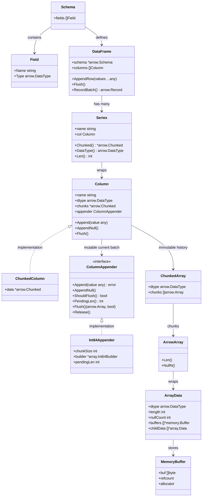
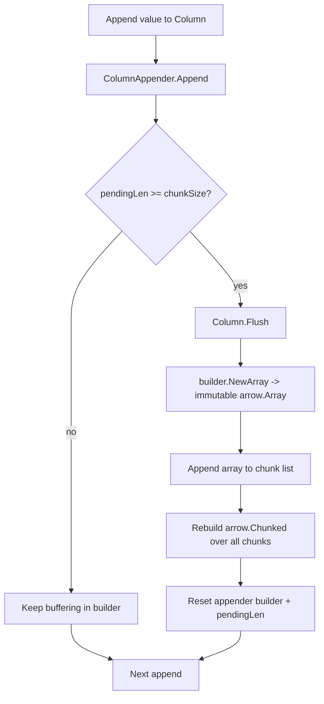
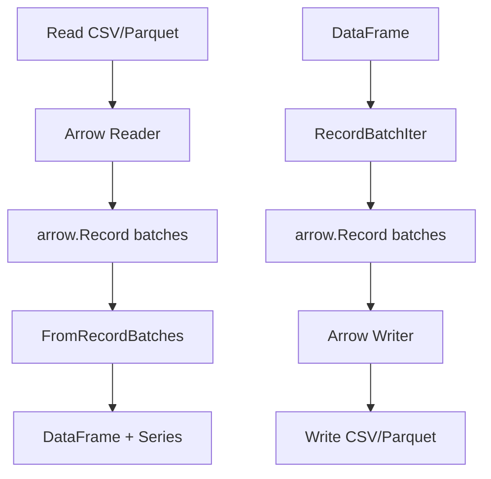
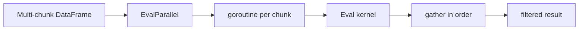

# Cosma DataFrame Architecture

This project follows an Arrow-native, append-first column model.

Architecture decisions are tracked in ADRs. See `docs/adr/README.md`.

## Class / Ownership Diagram


```mermaid
classDiagram
    class Schema {
      +fields []Field
    }

    class Field {
      +Name string
      +Type arrow.DataType
    }

    class DataFrame {
      +schema *arrow.Schema
      +columns []Column
      +AppendRow(values ...any)
      +Flush()
      +RecordBatch() arrow.Record
    }

    class Series {
      +name string
      +col Column
      +Chunked() *arrow.Chunked
      +DataType() arrow.DataType
      +Len() int
    }

    class Column {
      +name string
      +dtype arrow.DataType
      +chunks *arrow.Chunked
      +appender ColumnAppender
      +Append(value any)
      +AppendNull()
      +Flush()
    }

    class ChunkedColumn {
      +data *arrow.Chunked
    }

    class ChunkedArray {
      +dtype arrow.DataType
      +chunks []arrow.Array
    }

    class ColumnAppender {
      <<interface>>
      +Append(value any) error
      +AppendNull()
      +ShouldFlush() bool
      +PendingLen() int
      +Flush() (arrow.Array, bool)
      +Release()
    }

    class Int64Appender {
      +chunkSize int
      +builder *array.Int64Builder
      +pendingLen int
    }

    class ArrowArray {
      +Len()
      +NullN()
    }

    class ArrayData {
      +dtype arrow.DataType
      +length int
      +nullCount int
      +buffers []*memory.Buffer
      +childData []*array.Data
    }

    class MemoryBuffer {
      +buf []byte
      +refcount
      +allocator
    }

    Schema --> Field : contains
    Schema --> DataFrame : defines
    DataFrame --> Series : has many
    Series --> Column : wraps
    Column <|.. ChunkedColumn : implementation
    Column --> ChunkedArray : immutable history
    Column --> ColumnAppender : mutable current batch
    ColumnAppender <|.. Int64Appender : implementation
    ChunkedArray --> ArrowArray : chunks
    ArrowArray --> ArrayData : wraps
    ArrayData --> MemoryBuffer : stores
```

Related code:

- `schema.Schema` + `schema.Field`: [`schema/schema.go`](https://github.com/karthedew/cosma/blob/main/schema/schema.go), [`schema/field.go`](https://github.com/karthedew/cosma/blob/main/schema/field.go)
- `DataFrame` + `Series`: [`dataframe/dataframe.go`](https://github.com/karthedew/cosma/blob/main/dataframe/dataframe.go), [`dataframe/series.go`](https://github.com/karthedew/cosma/blob/main/dataframe/series.go)
- `Column` + `ChunkedColumn`: [`dataframe/column.go`](https://github.com/karthedew/cosma/blob/main/dataframe/column.go)

## DataFrame Structure

Cosma's DataFrame is a thin wrapper around Arrow chunked arrays, with a minimal
schema layer on top. Each `Series` is a named column backed by a `Column`
implementation, which in turn owns an `*arrow.Chunked` representing the physical
buffers. The `schema.Schema` type stores field metadata (`Name`, `Type`,
`Nullable`, and `ArrowType`) and is shared by the DataFrame and IO paths.

Key types in the codebase:

- `DataFrame` (`dataframe/dataframe.go`) holds a `*schema.Schema`, a slice of
  `Series`, and the logical height. See
  [`dataframe/dataframe.go`](https://github.com/karthedew/cosma/blob/main/dataframe/dataframe.go).
- `Series` (`dataframe/series.go`) pairs a name with a `Column` interface and
  exposes chunked access and dtype. See
  [`dataframe/series.go`](https://github.com/karthedew/cosma/blob/main/dataframe/series.go).
- `Column` (`dataframe/column.go`) is an interface implemented by
  `ChunkedColumn`, which wraps `*arrow.Chunked`. See
  [`dataframe/column.go`](https://github.com/karthedew/cosma/blob/main/dataframe/column.go).
- `schema.Schema` (`schema/schema.go`) is Cosma's lightweight schema with field
  lookup and copy-on-read semantics. See
  [`schema/schema.go`](https://github.com/karthedew/cosma/blob/main/schema/schema.go).

## IO Implementation

CSV and Parquet IO are built on Arrow readers/writers and a record batch
conversion layer that maps Arrow records into Cosma Series.

Read flow:

- `ReadCSV` (`dataframe/io.go`) uses Arrow's CSV reader with header and null
  handling enabled. It collects `arrow.Record` batches and converts them via
  `FromRecordBatchesWithOptions` (`dataframe/arrow_schema.go`). See
  [`dataframe/io.go`](https://github.com/karthedew/cosma/blob/main/dataframe/io.go)
  and [`dataframe/arrow_schema.go`](https://github.com/karthedew/cosma/blob/main/dataframe/arrow_schema.go).
- `ReadParquet` (`dataframe/io.go`) uses `pqarrow.FileReader` to read an Arrow
  table, then maps table columns to Series in `dataFrameFromTable`
  (`dataframe/io.go`). See
  [`dataframe/io.go`](https://github.com/karthedew/cosma/blob/main/dataframe/io.go).

Write flow:

- `WriteCSV` and `WriteParquet` build an Arrow schema from the DataFrame schema
  (optionally nullable), then stream `arrow.Record` batches produced by
  `RecordBatchIterWithSchema` (`dataframe/iter.go`) into Arrow writers. See
  [`dataframe/io.go`](https://github.com/karthedew/cosma/blob/main/dataframe/io.go)
  and [`dataframe/iter.go`](https://github.com/karthedew/cosma/blob/main/dataframe/iter.go).

Options:

- `CSVOptions` and `ParquetOptions` in `dataframe/io_options.go` provide
  defaults for nullable behavior, chunk sizing, and Arrow/Parquet properties.
  See [`dataframe/io_options.go`](https://github.com/karthedew/cosma/blob/main/dataframe/io_options.go).

## Append / Flush Lifecycle


```mermaid
flowchart TD
    A[Append value to Column] --> B[ColumnAppender.Append]
    B --> C{pendingLen >= chunkSize?}
    C -- no --> D[Keep buffering in builder]
    C -- yes --> E[Column.Flush]
    E --> F[builder.NewArray -> immutable arrow.Array]
    F --> G[Append array to chunk list]
    G --> H[Rebuild arrow.Chunked over all chunks]
    H --> I[Reset appender builder + pendingLen]
    D --> J[Next append]
    I --> J
```

Related code:

- `Series` builders and chunked helpers: [`dataframe/series_builder.go`](https://github.com/karthedew/cosma/blob/main/dataframe/series_builder.go)
- Record batch assembly: [`dataframe/iter.go`](https://github.com/karthedew/cosma/blob/main/dataframe/iter.go)

## IO Flow (CSV/Parquet)


```mermaid
flowchart TD
    A[Read CSV/Parquet] --> B[Arrow Reader]
    B --> C[arrow.Record batches]
    C --> D[FromRecordBatches]
    D --> E[DataFrame + Series]

    F[DataFrame] --> G[RecordBatchIter]
    G --> H[arrow.Record batches]
    H --> I[Arrow Writer]
    I --> J[Write CSV/Parquet]
```

Related code:

- CSV/Parquet entry points: [`dataframe/io.go`](https://github.com/karthedew/cosma/blob/main/dataframe/io.go)
- IO options: [`dataframe/io_options.go`](https://github.com/karthedew/cosma/blob/main/dataframe/io_options.go)
- Record batch conversion: [`dataframe/arrow_schema.go`](https://github.com/karthedew/cosma/blob/main/dataframe/arrow_schema.go)
- Example CLI usage: [`cmd/cosma-csv/main.go`](https://github.com/karthedew/cosma/blob/main/cmd/cosma-csv/main.go)

### Notes

- CSV reads default to header-based column names; missing values become nulls.
- Parquet reads preserve Arrow chunking and nulls, then map into Series.
- Writes emit Arrow records from `RecordBatchIter` and allow nullable schemas.

## Design Notes

- `ColumnAppender` owns temporary mutable Arrow builders.
- `Column` owns immutable arrays and exposes logical `*arrow.Chunked`.
- Flushes are safe to call repeatedly; when empty they are no-ops.
- Builders and arrays are reference-counted and must be released.

---

## Expression System

The public expression AST lives in `cosma/expr` (see [ADR 0004](adr/0004-public-expression-ast.md)).
All node types are exported: `ColumnNode`, `LiteralNode`, `BinaryNode`, `UnaryNode`,
`AggNode`, `AliasNode`, `CastNode`. The tree is inspectable, serializable, and safe
for external optimizer passes or plan deserialization.

Engine internals stay in `internal/expr` (coercion helpers, type promotion rules) and
`internal/compute` (kernel evaluation, kernel registration).

```
cosma/expr          — public AST nodes and fluent builder (expr.Col, expr.Lit, ...)
    ↓
internal/compute    — Eval(expr.Expr, record, mem) → arrow.Array
    ↓
dataframe           — Filter, WithColumn, GroupBy, Sort call Eval
```

`internal/compute` exposes `RegisterBinaryKernel` and `RegisterUnaryKernel` for
custom Arrow types (e.g. the future `carray` package).

Boolean kernels use Kleene three-valued null semantics. `Cast` and `Alias` nodes
are evaluated by the kernel. All Arrow primitive and temporal types are covered;
`List`, `Struct`, `Map`, and `Union` are explicitly rejected at bind time.

## Lazy Execution and Planning

```mermaid
flowchart TD
    A[df.Lazy()] --> B[LogicalPlan]
    B --> C[plan.Optimize]
    C --> D[plan.Lower to PhysicalPlan]
    D --> E[DataFrameExecutor.Execute]
    E --> F[*DataFrame]
    E --> G[dataframe.RecordReader stream]
```

The lazy pipeline has three stages:

1. **Bind** — `plan.Bind(lp)` resolves column references against the schema and
   produces a type-checked logical plan.

2. **Optimize** — `plan.Optimizer` applies predicate pushdown, projection pushdown,
   and limit pushdown into `ScanNode`, annotating it with `PushedFilters`,
   `PushedColumns`, and `PushedLimit`.

3. **Lower + Execute** — `plan.Lower` produces physical nodes (`PhysFilter`,
   `PhysSort`, `PhysAgg`, `PhysJoin`, etc.). Each physical node calls through the
   injected `plan.Executor` interface, implemented by `DataFrameExecutor` in the
   `dataframe` package. This interface breaks the `plan ↔ dataframe` import cycle.

`LazyFrame.Collect(ctx)` materializes the result as a `*DataFrame`.
`LazyFrame.CollectStream(ctx)` returns a `dataframe.RecordReader` for per-batch
streaming without full materialization.

Key files:
- `plan/logical.go`, `plan/physical.go`, `plan/optimizer.go`, `plan/lower.go`
- `plan/executor.go` — `Executor` interface
- `dataframe/executor.go` — `DataFrameExecutor` implementation
- `dataframe/lazy.go`, `dataframe/stream.go`

## Streaming Execution

Streaming follows the boundary in [ADR 0002](adr/0002-streaming-execution-boundary.md):
filter, project, and limit are applied per `arrow.RecordBatch` as it arrives from the
scan source. Pipeline-breaking operators (sort, groupby, join) materialize their full
input before producing output.

`scan.LazyScanCSV` and `scan.LazyScanParquet` return a `LazyFrame` backed by a
streaming scan source. The `scan.RecordReader` interface (5 methods: `Schema`, `Next`,
`Record`, `Err`, `Release`) is structurally identical to `dataframe.RecordReader` but
declared separately to avoid a `dataframe → scan` import cycle.

## Parallel Execution


```mermaid
flowchart LR
    A[Multi-chunk DataFrame] --> B[EvalParallel]
    B --> C[goroutine per chunk]
    C --> D[Eval kernel]
    D --> E[gather in order]
    E --> F[filtered result]
```

`internal/compute.EvalParallel` fans filter evaluation across goroutines using
`errgroup`, collects results in original order, and merges them. Worker count is
bounded by `min(Parallelism(), len(chunks))`.

`GroupReduceParallel` uses a two-phase approach: parallel local aggregation over
disjoint chunk slices, then a sequential merge of the partial results.

`OpMetrics` / `LastMetrics()` records the operator name, worker count, rows processed,
and elapsed time for the most recent parallel operation.

## ADBC Connectivity

`internal/ingest.ADBC(ctx, db, cfg)` is the ADBC adapter. It accepts any value
implementing `adbc.Database`, opens a connection, executes the SQL query, and returns
an `array.RecordReader` — the same type returned by the CSV and Parquet adapters.

```
adbc.Database.Open → adbc.Connection
adbc.Connection.NewStatement → adbc.Statement
adbc.Statement.SetSqlQuery / ExecuteQuery → array.RecordReader
```

The `adbcReader` wrapper adds context cancellation (checked between batches) and
teardown (statement then connection released on `Release()`). ADBC schemas are Arrow
schemas — no mapping needed; null bitmaps pass through unchanged.

See [`examples/adbc/main.go`](../examples/adbc/main.go) for a complete end-to-end example.

## Gonum Integration

`cosma/gonum` exports numeric DataFrame columns and Series to Gonum matrix and vector
types. Null handling is explicit — callers choose `NullError`, `NullDrop`, or `NullFill`;
there is no default silent behavior.

`ToMatrix` extracts numeric columns in schema order (or a caller-specified order) and
builds a row-major `*mat.Dense`. `ToVector` extracts a single numeric Series as a
`*mat.VecDense`. Both return an explicit error rather than calling `NewDense(0, c, nil)`
or `NewVecDense(0, nil)`, which panic with `ErrZeroLength` in Gonum v0.17.0.

For the public package surface, see [docs/packages.md](packages.md).
